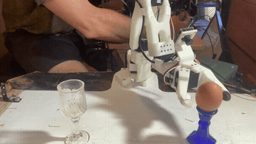
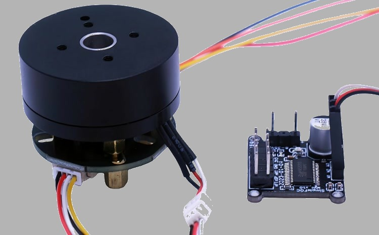
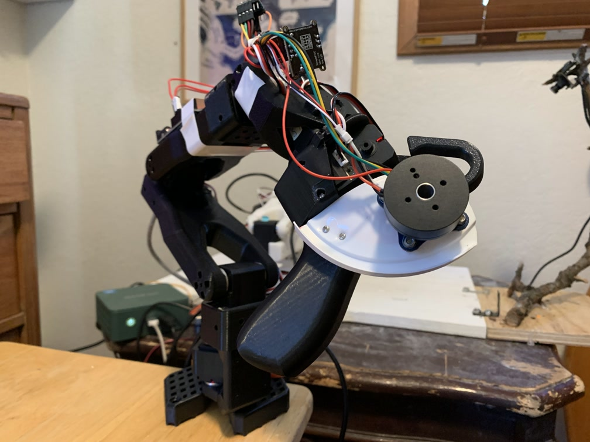
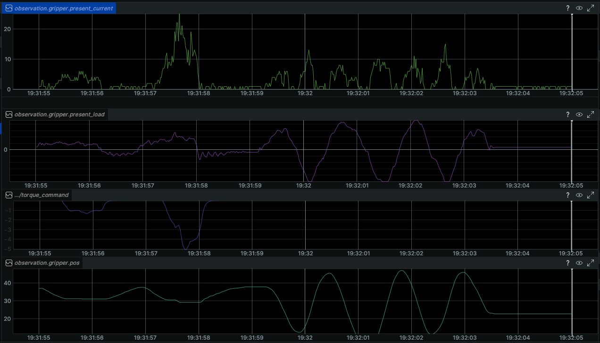
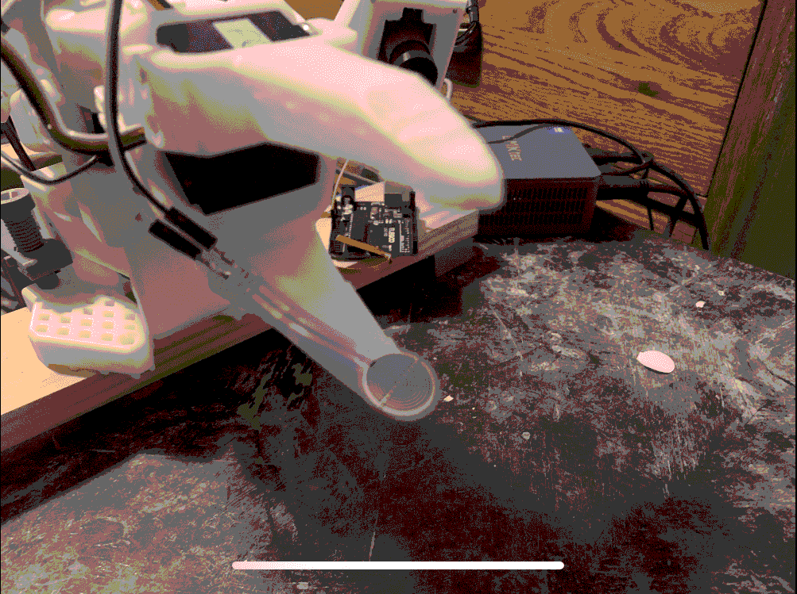

# Haptic Feedback for LeRobot SO-101



This project adds haptic feedback to the SO-101 Leader. The leader gets a brushless ["gimbal" motor](#glossary) at the gripper joint that pushes back on the operator's hand when the follower gripper is under load. Without feedback, operators tend to squeeze too hard, and those actions enter the training dataset and get imitated during autonomous operation.

How can we sense the force that the robot's gripper is applying? You could add a force sensor in the jaw of the gripper and integrate that into LeRobot, but that would be unnecessary. (I learned that the hard way 😂). Because it turns out that measuring the gripping force in real time can also be achieved by simply asking the gripper servo how much current it's drawing.

---

## Hardware

**Leader side:**
We need a gripper control that we can move smoothly, but one that will also provide force/torque feedback to let us know what's happening on the follower side. Using the leader's gripper servo isn't an option; even the lowest gear-ratio feetech servo (as is used in the SO-101 leader) has too much static friction to be capable here; it takes too much operator force just to get it moving, so can't be operated with a light touch.

<p float="left">
  
  
</p>

Enter: the *gimbal motor*.

The new motor is controlled by an Arduino running [SimpleFOC](https://simplefoc.com), an open-source field-oriented control library that makes torque-mode BLDC control easy to use. Note: SimpleFOC also requires a small motor driver board.

**Follower side:**
Stock SO-101! Originally for this project I used an analogue force sensor (a force-sensitive resistor), but now we read load/current values from the stock follower servo. All that's required is a Python package (from this repo; discussed below) to make the follower read motor current/load and append that to its observation dict in `get_observation()`.

---

## How It Works

`teleop.send_feedback()` is called in the teleop loop with the latest robot observation; it calculates the strength and direction of feedback that should be sent to the feedback motor on the teleoperator.

Here's the full signal chain:

```
Present_Current ──EMA(α=0.2)──► smooth_current ─┐
                                                ├─ × gripper_vel_weight ──► lockout check
Present_Load ────EMA(α=0.2)──► smooth_load      │                               │
                                                │                     if below threshold:
gripper.pos ─── diff×60 ──► gripper_velocity    │                         torque = 0
                    │                           │                               │
                    └──── gripper_vel_weight    │                     else:
                          = 1/(1 + 0.05×|v|) ───┘                       raw_torque =
                                                                            -copysign(
                                                                              scalar × weight × current,
                                                                              load
                                                                            )
                                                                               │
                                                                          EMA(α=0.3)──► gimbal torque
```

Here's a look at the input signals in question, along with the calculated torque that gets sent to the leader's gimbal motor. At the beginning of the 10 second window displayed, I squeeze an object (roll of electrical tape) a couple times, first soft and then hard. Notice that at that time, the motor current is high and the gripper isn't moving very much (in contact with the tape roll), and the gimbal torque (magnitude) is high (negative because it's pushing to "open" the teleop's gripper). At the end of the window, I open and close the gripper a few times in free space. The gripper is moving fast, and the servo current is significant, but the torque sent to the servo is at zero (the top line of that graph, since all values are negative).

We'll dig into the relationships between these quantities later on, but for now you can see that the torque sent back to the leader correlates with gripping force, and ignores (even fast) gripper movements in free space, which achieves the goal of feeling the robot's gripping force at the teleoperator in real time.



**Smoothing the input signals:** Reading the load values from the servo ([`Present_Current` and `Present_Load`](#glossary)), these values were *super* bouncy. The current would exhibit a smooth envelope but inside that envelope it would oscillate wildly from 0 up to the maximum instantaneous value.

This problem was easily solved by smoothing, using an [exponential moving average](#glossary): `smooth += α * (new_value - smooth)` with α=0.2.

**Velocity weighting:** At this point, the teleop gripper was resistant to movement even when the robot's gripper wasn't touching anything (dragging a paddle through oil feeling). This resistance on the teleop gripper wasn't desirable, since I wanted the feedback force to alert the user to contact with an object. Luckily, it wasn't difficult to devise a scheme for damping the motion-induced feedback without affecting the real gripping force feedback. This is based on the realization that

There are two things which can trigger current in the servo motor:
1. squeezing an object
2. moving in free space (significant current is needed to overcome high friction in the servo's gear train)

And these two conditions are easy to differentiate because [drum roll] the motor can tell us its position! So by keeping track of the position (and calculating velocity as the difference between the current position and the previous one) we can formulate a factor that will scale the feedback gain we give to the teleop:
`1 / (1 + 0.05×|v|)`
This factor is approximately 1 when the motor is nearly stopped (squeezing something), but drops to about 0.25 when the gripper is moving briskly.

**Smoothed output torque and velocity-weighted lockout:** At this point, the haptic feedback teleoperator was performing well, but there was a major flaw: whenever I released the teleoperator's gripper control, it (and the robot's gripper) would begin to oscillate *wildly*. What was up with this?

Well, the system was unstable. Let's imagine how a small perturbation propagates through the feedback loop. Say the reported motor current isn't exactly zero (this happens often, it sometimes sits at about 10 mA, even when there is no load or change to the servo). This causes the teleop.send_feedback() to send a torque back to the leader arm, which makes the gimbal motor move. This movement is interpreted as an action, which gets sent to the follower, telling *it* to move, increasing current in its motor, and therefore sending an even larger torque back to the gimbal. You can see how this quickly gets out of control.

I hoped this could be solved by smoothing the gimbal torque itself, using another exponential moving average on the torque command before writing it to the gimbal. This mellowed out the oscillations quite a bit, but couldn't eliminate them entirely without starting to dull out responsiveness to **true grip**.


My next idea was a "lockout," where a small current would not be translated into a feedback torque at all. This was promising, but it made real gripping feedback less responsive, since it ignored the current caused by the initial gripping force on an object. But by bringing back the last idea, the velocity weight, and combining that with the lockout, I arrived at a good solution. The velocity-weighted current sits below a threshold, and is locked out from actuating feedback torque, but the stationary / slow-moving gripper that is actively gripping produces a current that pops above the threshold, triggering the desired feedback torque on the teleop.

**EMA on output torque (α=0.3):** ~14 dB rejection at 20 Hz.
We were *very* close to good now, but if I let go of the gimbal motor carelessly (with sort of a nudge), a rapid oscillation could start to build in the system. Since this oscillation was happening at a high frequency, we could smooth the calculated output torque as a last step, and this was able to filter out the high frequency oscillation without noticeably affecting responsiveness to real gripping. Whew!

### Constants (results of tuning)

```python
CURRENT_TORQUE_SCALAR     = 0.3
CURRENT_LOCKOUT_THRESHOLD = 2.0
SIGNAL_SMOOTH_ALPHA       = 0.2
TORQUE_SMOOTH_ALPHA       = 0.3
GRIPPER_VELOCITY_K        = 0.05
```

---

## Software Integration

The two packages in this repo each install as a LeRobot robot or teleoperator. LeRobot automatically discovers installed embodiments by naming convention, so these slot into the standard `lerobot-record` / `lerobot-teleoperate` scripts with no modifications to LeRobot itself.

However, LeRobot's `lerobot-record` and `lerobot-teleoperate` don't call `send_feedback` automatically yet; I provide patched copies in `examples/` (discussed below).

> **Note:** I've submitted [PR #3733](https://github.com/huggingface/lerobot/pull/3733) to add the `send_feedback` call upstream. Once that merges, no manual patching will be needed in lerobot_teleoperate.py or lerobot_record.py.

The `feedback_features` property on `SOFeedbackLeader` signals to LeRobot that this teleoperator supports feedback, and declares which observation keys it needs:

```python
@property
def feedback_features(self) -> dict[str, type]:
    return {
        "gripper.present_current": float,
        "gripper.present_load":    float,
        "gripper.pos":             float,
    }
```

---

## Install

Clone this repo, then install both packages in the virtual environment you use for lerobot:

```shell
pip install -e lerobot_robot_so_feedback_follower
pip install -e lerobot_teleoperator_so_feedback_leader
```

**Note**: LeRobot recommends conda (via miniforge), and uv is also recommended.

---

## Use

Patched copies of `lerobot-record` and `lerobot-teleoperate` are in `examples/`:

```shell
python examples/lerobot_teleoperate.py \
    --robot.type=so_feedback_follower \
    --robot.port=/dev/replace-with-follower-port \
    --robot.id=my_feedback_follower \
    --teleop.type=so_feedback_leader \
    --teleop.port=/dev/replace-with-leader-port \
    --teleop.feedback_port=/dev/replace-with-gimbal-port \
    --teleop.id=my_feedback_leader \
```

`teleop.feedback_port` is for the Arduino that piggybacks on the teleop to control the gimbal motor.

**First run — calibration:** On first run, LeRobot will walk you through calibrating the arm joints as usual. The gimbal motor has its own calibration that runs after the regular one. The gimbal motor can rotate continuously (unless you add your end-stops), so just move the gimbal through the range of motion you want to use to control the gripper, park it somewhere roughly in the middle of its range, then press Enter. Done!

---

## Backstory: Force Sensors, Ablation Tests, and a Facepalm

The project didn't start sensorless. I built a complete working system with a force sensor. Then I set out to show that it would not work without one—and accidentally proved you can.

### v1: Force Sensor

The original design added a force-sensitive resistor (FSR) to the follower's gripper (in the bottom jaw), read by a second Arduino Uno. The `SOFeedbackFollower` robot class read it and added `sensor.force` to the observation dict.



I developed and completed this version, complete with an (in-software) [proportional controller](#glossary) to make the gripper hold with a constant, light force, and ended up with a satisfactory, working solution.

### The Ablation Study

About the time I finished the project, I started to anticipate the question: "Is the force sensor necessary?" And to be honest, I thought it was. But at the time, I was also doing some safety research into reading back motor currents from the feetech servos, so I figured I should give it a shot and see how impossible it was to use that noisy signal to provide the feedback signal. Only, it wasn't impossible at all. It actually worked quite well, and yielded a perfectly viable feedback solution after about an hour's effort. Who knew?

Here's a dump of the twists and turns of the development process (**warning**: not interesting in the slightest).

#### With the sensor

I experimented with making the gimbal motor provide vibration feedback. A higher gripping force would correspond to a higher amplitude of the vibration, and to get the contact force to roll on faster, I normalized it and took the square root to amplify smaller values; I also experimented with a derivative term that would give the teleoperator a "thud" when the sensor force experienced a sudden increase. This worked, but the sensor had an issue with responsiveness. It didn't roll on smoothly, it would be 0, 0, 0, then shoot up super high at a significant amount of force. It was difficult when operating by hand to work the controls such that the gripper maintained a moderate force on the object. To achieve this, I added a proportional controller to regulate grip force at a setpoint of 20 (on a 0–100 scale) once contact was detected. The operator could still override with an intentional squeeze, and break out by opening the teleop significantly.

So now we have a P controller. And would you believe this introduced oscillation? First attempt oscillated (at about 3 Hz). Reduced gain and added a deadband. Still oscillated. Discovered that the controller reset on losing contact (software bug), causing grip-release-regrip cycling. The fix: on losing contact, don't reset; instead freeze the gripper at whatever position it was last commanded to hold. That breaks the cycle because the gripper stays put rather than opening and immediately re-triggering contact. Overshoot remained: the controller was opening the gripper past the initial contact point, back into no-grip territory. Fixed by recording the gripper position at first contact and clamping the controller so it couldn't open past that point. Added a spring torque: when the teleop gimbal is held more closed than the robot's actual gripper position, a restoring force pushes it back toward open, giving the operator a feel for how far they're squeezing past the initial point of contact, while only allowing a small amount of tighter squeezing through to protect gripper servo.

At this point I was happy with the performance, I thought I had done a great job, and I made the robot give me a pat on the back. Surely the sensor was necessary. Even Claude agreed. There was no way a noisy, low-resolution current measurement would work for adding a delicate feedback touch. Right?...

#### After removing the sensor

The idea: try to use ([`Present_Load`](#glossary)) (signed value) to determine which direction to push the gimbal, and ([`Present_Current`](#glossary)) for how hard. This worked right away. You could feel resistance when gripping, but it was jumpy, with oscillations around 10 Hz. This was a direct result of large oscillations in those motor readings (current and load).
Applied EMA smoothing (α=0.2) to both input signals before computing torque...much smoother!
But when you let go of the teleop gripper, the system would oscillate rather than settle. This got me thinking about motor currents, and the two different causes: motion and gripping. Because servos have high friction in their gear trains, they require substantial current to move at moderate speed, similar to the current drawn during moderate gripping. By tracking the servo's velocity, computed as the difference between the current position reading and the previous one, I could tell these two cases apart and scale the feedback torque by `1 / (1 + k|v|)`: high velocity attenuates the torque, near-stationary lets it through fully. There was still ~20 Hz vibration in the torque output; input smoothing alone wasn't enough. Applied another EMA (α=0.3) to the output torque before writing it to the gimbal. This eliminated the 20 Hz vibration, but a new problem appeared: a slower, 1 Hz large-amplitude oscillation when releasing the gimbal carelessly (or bumping it). Tried adding a derivative term based on gimbal velocity to resist free swinging, but noisy velocity readings and closed-loop system dynamics introduced challenges to this approch, which wasn't looking promising. Abandoned. Instead of adding a damping torque (sign-sensitive, noise-dangerous), the insight was to use gimbal velocity as a multiplicative weight on the torque: the same structure as the gripper velocity weighting. When the gimbal is moving fast, the torque gets attenuated; if noise causes a spurious velocity spike, it just attenuates more, which is safe. This helped, but didn't fully eliminate the 1 Hz oscillation. The key insight was that when nothing is being gripped and the teleop is released, the smooth current should be near zero, so there's no reason to drive the gimbal at all. Added a lockout: if smooth current is below a threshold, output zero torque. This broke the feedback loop at idle and eliminated the 1 Hz oscillation entirely. Removed the gimbal velocity smoothing since it seemed redundant, and mild oscillation crept back. The mild oscillation was happening because during the oscillation, current could briefly spike above the lockout threshold, re-engaging the torque and sustaining the loop. The fix came from combining the two ideas already in play: the lockout and the velocity weighting. Rather than comparing raw smooth current to the threshold, apply the gripper velocity weight to the current first. Now, high current during fast gripper movement gets discounted before the comparison — only slow, stationary-gripper current can unlock the feedback. Motion current, even if large, can't accidentally engage the loop. No oscillation on release, clean engagement on contact. Done. And happy.

---

## Glossary

**gimbal motor**: A brushless DC (BLDC) motor, similar to drone motors, and commonly used in camera stabilization gimbals. Unlike a servo, which resists movement even when unpowered, a BLDC motor moves freely, can exert a specified torque via well-timed motor currents, and when paired with an encoder (standard practice with systems like SimpleFOC) accurately reports its position.

**proportional controller (P controller)**: A feedback controller that adjusts its output in proportion to the error between a measured value and a target. The larger the error, the larger the correction. Simple and effective, but prone to oscillation if the gain is set too high.

**`Present_Current`**: Raw motor current "counts" from the servo. By my measurement, each count is about 6 mA. This value is unsigned, representing only the magnitude of the current.

**`Present_Load`**: Correlated to the PWM output of the servo's PID controller, according to feetech's documentation. This is a signed quantity, so you get positive/negative values depending on which direction the motor is pushing.

**EMA (exponential moving average)**: A simple low-pass filter: `smooth := (1 - α) × smooth + α × new_value`. α near 0 is heavy smoothing; α = 1 is no smoothing.
